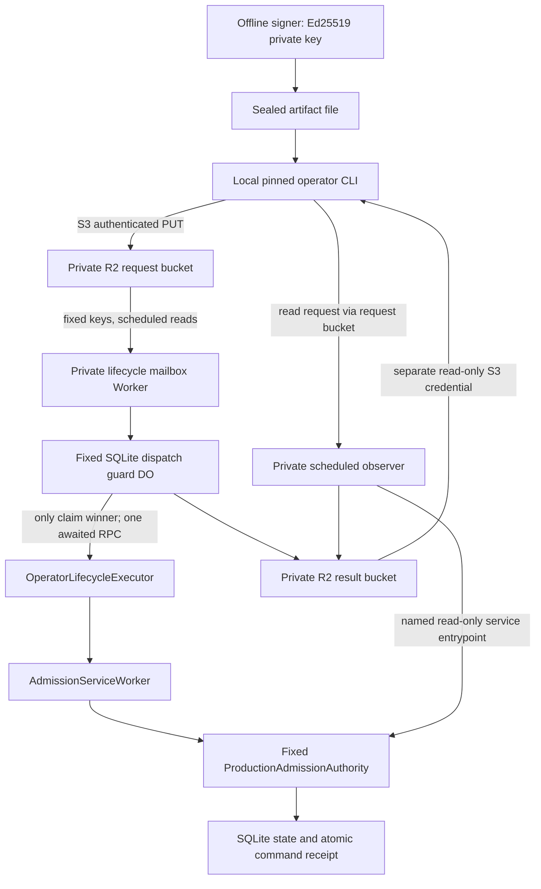

# Phase 5C-I3B — Provider-authenticated private lifecycle invocation

Architecture decision, 2026-09-19. Baseline inspected: `ffaaad43ccb13e96b3628ec2fef8c4a67445d33a` (`ffaaad4`, Add private authority lifecycle tooling).

This document selects a design for future implementation. It does not authorize deployment, provisioning, credential creation, signing, or a real lifecycle mutation. I3A remains an approved disabled/private tooling checkpoint. **I3 control-plane provisioning remains BLOCKED pending implementation, independent review, and the gates below.**

Evidence labels: **DOCUMENTED** means current official Cloudflare documentation; **INSPECTED** means repository source at the baseline; **DESIGN** means a requirement proposed here, not existing functionality; **NOT VERIFIED** means no supporting live-account or runtime experiment was performed. Source links support provider facts, not a claim that Cloudflare has reviewed this composition.

## 1. Executive decision

**Select Candidate E: private R2 command mailbox + scheduled Worker + durable, single-use dispatch guard + the existing private executor chain.** Use a separate private R2 result bucket and a narrow authoritative read path. This is a composition of supported Cloudflare primitives, not a newly discovered Cloudflare job product.

The local operator uploads the already-signed artifact using bucket-scoped R2 S3 credentials. A scheduled Worker examines a small, fixed set of mailbox keys. Before any lifecycle RPC, a fixed SQLite Durable Object atomically consumes that command's dispatch permission and durably flushes the record. Only the invocation that created that record can call the executor. Later polls, concurrent deliveries, restarts, and identical submissions return recorded status or UNCONFIRMED; they cannot dispatch the mutation again.

This is **at-most-one application dispatch per canonical command digest**, not exactly-once execution or guaranteed completion. A crash between consuming permission and making the call may sacrifice a valid command. That availability cost is intentional. I3B must not implement a lease expiry, automatic rearm, retry queue, or operator `--force` bypass.

Why this choice:

- No lifecycle Worker is publicly routed. The externally reachable upload endpoint is Cloudflare's authenticated R2 storage API; the application has no lifecycle HTTP endpoint.
- The invocation credentials cannot deploy Workers, change bindings, access authority storage, or write result objects. Offline Ed25519 authorization remains independently necessary.
- Duplicate input processing is structurally separated from lifecycle dispatch. Safety does not depend on Workflow retry interpretation or message-delivery uniqueness.
- Authoritative reconciliation survives loss of both the original RPC response and the mailbox result.
- R2 adds polling and two buckets, but avoids broad Workflow management credentials, Workflow restart semantics, Queue redelivery management, and a public application authentication surface.

Workflows is the best direct provider job interface examined, but its documented creation permission and durable replay behavior make the simple Workflow-to-executor proposal unsuitable. Adding the same dispatch guard would fix replay, but would not establish an invocation-only credential. The new individual Worker roles deserve future investigation; they are not proof of an invocation-only Workflow role.

The selected design is safe to implement only with the dispatch guard, authoritative command receipts, separate result permissions, and fail-closed recovery rules specified here. Removing any of those changes this decision.

## 2. Current gap and repository findings

**INSPECTED:** `PHASE5C_I3A_OPERATOR_SUBMITTER.md`, `operator/lifecycle-submitter.ts`, `workers/operator-lifecycle-executor.ts`, `workers/admission-service/index.ts`, `workers/admission-service/operator-command.ts`, `workers/admission-service/authority.ts`, the executor template, CLI source, and the I3 runbook.

The implemented chain is:

```text
offline signer -> { command: [...], signature: "..." }
                                |
                                v
local proof -> OperatorLifecycleExecutor -> AdmissionServiceWorker
                                            -> ProductionAdmissionAuthority -> SQLite

deployed local operator -> MISSING TRANSPORT -> private executor
```

The submitter deliberately exits UNAVAILABLE without a deployed transport. Its sealed-artifact ceiling is 4,096 bytes. It rejects invalid UTF-8/BOM, duplicate JSON members, extra fields, wrong Production target, invalid signatures and stale commands. The Production executor exposes two fixed RPC methods and returns HTTP 404. Admission resolves a fixed authority name. No generic RPC dispatcher exists.

Existing limitations relevant to I3B:

1. The executor is a stateless `WorkerEntrypoint`; it does not remember dispatch attempts across invocations.
2. Authority initialization and rotation use SQLite transactions, but do not record a canonical signed-command digest.
3. Initialization's `already-initialized` comparison depends on there being exactly one matching, unretired release. Later rotation changes that evidence.
4. Rotation's `already-rotated` comparison checks release transition fields but does not include the signed issuance timestamp. Two different signed commands can describe the same transition. Later rotations also remove old release rows after retention permits it.
5. Freshness is checked before signature verification in the DO adapter; reconciliation cannot be implemented by resubmitting an old command.
6. No narrow authoritative read-only reconciliation RPC exists. The current authority constructor calls `createAuthoritySchema`; merely adding a SELECT method would not make the whole activation path read-only.
7. Initialization supports a staging label in the shared protocol; rotation and the I3A executor are Production-only. A real staging lifecycle needs an explicitly reviewed environment implementation, not Production artifacts sent to a Worker renamed staging.

The initial working tree matched the brief: only `PHASE5C_I3_PROVISIONING_RUNBOOK.md` was untracked. Its SHA-256 before this work was `BC5F506B0125DBED4A0979E9A63C4C03E8030A7DAD50DF548D4516E608CCF3A3`.

## 3. Current official provider capabilities

### 3.1 Workflows trigger, input and results

**DOCUMENTED:** create an instance with `POST https://api.cloudflare.com/client/v4/accounts/{account_id}/workflows/{workflow_name}/instances`, authenticated with `Authorization: Bearer <API_TOKEN>`. The documented accepted permission is **Workers Scripts Write**. The body exposes `instance_id`, `params`, retention and location options; creation reports an instance and provider execution status, not a lifecycle commit. [Create instance API](https://developers.cloudflare.com/api/resources/workflows/subresources/instances/methods/create/).

`GET /accounts/{account_id}/workflows/{workflow_name}/instances/{instance_id}` returns execution details including `params`, output, errors and step attempts. Accepted permissions include Workers Scripts Read, Workers Tail Read, or Workers Scripts Write. A separate `/step` endpoint retrieves full step output. Inputs therefore cannot be treated as transient or hidden from authorized provider readers. [Get instance API](https://developers.cloudflare.com/api/resources/workflows/subresources/instances/methods/get/).

Bindings support `env.WORKFLOW.create({ id, params })` and `get(id)`, with instance status/control APIs. The binding can identify a Workflow in another script in the same account. TypeScript types do not replace input validation. [Trigger Workflows](https://developers.cloudflare.com/workflows/build/trigger-workflows/), [events and parameters](https://developers.cloudflare.com/workflows/build/events-and-parameters/).

Provider payload limit: 1 MiB; ordinary non-stream step output: 1 MiB. Completed instance state/log retention is up to 3 days on Free or 30 days on Paid, with shorter configurable retention. Instance IDs have a 100-character creation limit. These are not lifecycle retention guarantees. [Workflow limits](https://developers.cloudflare.com/workflows/reference/limits/).

### 3.2 Workflows durability, retries and cancellation

Default step configuration is retry limit 5, initial delay 10 seconds, exponential backoff, and a 10-minute timeout. Per-step configuration and `NonRetryableError` control ordinary failure retries. A proposed mutation step would require `retries: { limit: 0, delay: "1 second" }`, bounded timeout, and handling dispatched errors as a normal UNCONFIRMED result. **NOT VERIFIED:** zero-limit behavior on a live account; the guide's attempts/retries wording is not an at-most-once contract. [Sleeping and retrying](https://developers.cloudflare.com/workflows/build/sleeping-and-retrying/).

**INSPECTED:** the installed Miniflare Workflow engine compares the attempted count to `config.retries.limit` when deciding an ordinary retry, consistent with zero disabling subsequent exception attempts. This supports local semantics, not a proof about provider infrastructure restart or replay.

The decisive issue is broader than exception retries: Cloudflare warns that engine restart can begin a step again, and side effects outside steps can repeat. A successful external mutation and persistence of the step result are not one transaction. Catching an exception or throwing `NonRetryableError` cannot protect against the process disappearing before that catch executes. [Rules of Workflows](https://developers.cloudflare.com/workflows/build/rules-of-workflows/).

`PATCH .../instances/{instance_id}/status` supports pause, resume, terminate and restart; current API also exposes optional rollback on termination and restart-from-step. None undoes an already committed authority transaction. No lifecycle compensation/reset handler may be registered. Termination is not evidence of non-commit. [Instance status API](https://developers.cloudflare.com/api/resources/workflows/subresources/instances/subresources/status/methods/edit/).

### 3.3 Private service-binding RPC

Service bindings call Workers without a publicly accessible URL. RPC is supported between Workers/DOs in the same account; no cross-account binding is assumed here. Exported `WorkerEntrypoint` classes expose public RPC methods, and `entrypoint` selects a named class. TypeScript interfaces alone do not restrict the actual remote methods. [Service bindings](https://developers.cloudflare.com/workers/runtime-apis/bindings/service-bindings/), [RPC overview](https://developers.cloudflare.com/workers/runtime-apis/rpc/), [named entrypoints](https://developers.cloudflare.com/workers/runtime-apis/bindings/service-bindings/rpc/).

Calls must be awaited. An RPC execution context ends with the call, and caller disconnection can cancel the server context. Worker entrypoint instance fields are not durable command history. Remote exceptions propagate; their occurrence does not prove rollback. The documented interface supplies no lifecycle transaction/retry guarantee; I3B must contain no application retry on a lifecycle RPC, including errors marked retryable. **NOT VERIFIED:** exhaustive internal transport retry behavior in the deployed path; live dispatch instrumentation is a provisioning gate. [RPC lifecycle](https://developers.cloudflare.com/workers/runtime-apis/rpc/lifecycle/), [error handling](https://developers.cloudflare.com/workers/runtime-apis/rpc/error-handling/).

### 3.4 API credentials and recent permissions changes

User API tokens inherit a subset of user permissions. Account API tokens are independent service principals; current compatibility includes Workflows, Workers, R2 and Queues. Account-token administration requires Super Administrator permission, which is not an operator submission permission. [Account API tokens](https://developers.cloudflare.com/fundamentals/api/get-started/account-owned-tokens/).

**Important current change:** on September 15, 2026 Cloudflare announced tokens scoped to individual Workers, with Metadata Read-Only, Content Read-Only, Editor and Admin roles. It would be incorrect to state that all current Worker tokens are necessarily account-wide. [Granular Worker permissions announcement](https://developers.cloudflare.com/changelog/post/2026-09-15-granular-worker-permissions/).

However, Editor can change Worker code/settings, and deployment with bindings does not generally require separate rights on every bound resource. The exact mapping of a single-Worker token to Workflow instance creation, and restrictions on acquiring other service/DO bindings, are **NOT VERIFIED**. No documented create-instance-only Workflow permission or exact Workflow-instance resource policy was established. A wrapper's hard-coded URL cannot constrain a stolen general-purpose credential. [Workers authorization](https://developers.cloudflare.com/workers/authorization/), [API permission catalog](https://developers.cloudflare.com/fundamentals/api/reference/permissions/).

Tokens support resource scoping and optional expiry/IP restrictions. Rotation/revocation is separate from operator-key rotation. No Global API Key is acceptable. [Create tokens](https://developers.cloudflare.com/fundamentals/api/get-started/create-token/), [roll tokens](https://developers.cloudflare.com/fundamentals/api/how-to/roll-token/).

### 3.5 Wrangler

The documented invocation is `wrangler workflows trigger <NAME> <PARAMS> --id <ID> --json`; `workflows instances describe <NAME> <ID>` obtains status. Pin `--config`, the configuration's account ID, and the intended environment; never permit an interactive account choice or inherited default. `--env` chooses configuration, not an immutable security identity. [Workflow commands](https://developers.cloudflare.com/workers/wrangler/commands/workflows/), [Wrangler](https://developers.cloudflare.com/workers/wrangler/).

**INSPECTED:** installed Wrangler is 4.131.1. Its trigger handler parses the positional JSON, calls the create-instance REST endpoint, and reports queued status. It can echo invalid parameters in an error. It does not await a lifecycle result. Its request body sends parsed `params`, whereas the current REST schema describes `params` as a JSON-encoded string. **NOT VERIFIED:** exact live serialization compatibility; a future Workflow implementation must resolve this before use.

General Wrangler is not the selected mutation client: it exposes target selection, may reveal arguments in shell/process/debug output, has no required Production-confirmation contract, and its transport behavior is not a pinned lifecycle no-retry interface. Do not use `npx ...@latest`, OAuth fallback, debug logging, `wrangler tail`, or remote development as the Production submit procedure.

### 3.6 Selected primitives: R2, Cron and SQLite DO

R2 supports S3-compatible object operations and credentials scoped to a specific bucket. Use **Object Read & Write / Workers R2 Storage Bucket Item Write** for the request bucket and a separate **Object Read only / Workers R2 Storage Bucket Item Read** credential for the result bucket. These object-level credentials use the S3 API, not the Cloudflare management REST API. The S3 endpoint is `https://<ACCOUNT_ID>.r2.cloudflarestorage.com`, authenticated using its access key ID and secret access key. [R2 authentication](https://developers.cloudflare.com/r2/api/tokens/), [S3 setup](https://developers.cloudflare.com/r2/get-started/s3/).

R2 documents strong read-after-write consistency and supported GET/PUT operations. That does not make a PUT transactional with a DO mutation. Buckets must have public access disabled. [R2 consistency](https://developers.cloudflare.com/r2/reference/consistency/), [S3 compatibility](https://developers.cloudflare.com/r2/api/s3/api/), [public bucket controls](https://developers.cloudflare.com/r2/buckets/public-buckets/).

Cron invokes a Worker's `scheduled()` handler. Configure a one-minute schedule; do not depend on prompt delivery or a unique scheduled event. Schedule changes may take up to 15 minutes to propagate. [Cron Triggers](https://developers.cloudflare.com/workers/configuration/cron-triggers/).

SQLite DO storage supports transactions and `sync()` to await durable writes. Output gates hold outgoing messages until preceding writes persist; failed writes discard outgoing messages. The design additionally awaits `sync()` before dispatch and forbids `allowUnconfirmed`. [SQLite storage API](https://developers.cloudflare.com/durable-objects/api/sqlite-storage-api/), [DO output gates](https://developers.cloudflare.com/durable-objects/reference/glossary/). These documented primitives support the guard proof in Section 9; the proof is our design inference, not a Cloudflare exactly-once promise.

## 4. Candidate comparison

### A — Direct authenticated Workflow creation

The proposed chain is technically supported: provider API -> dedicated Workflow -> service binding -> executor -> admission -> authority. A Workflow can use its Worker's bindings without holding the offline key. Pin the account, Workflow name, script/class and service binding in reviewed configuration; never accept them in parameters.

Reject the **simple** version. At T6, ordinary exception retry might be disabled, but a runtime restart can revisit a step whose result was not persisted. Calling the executor outside a step is worse. A separate previous step recording `dispatched=true` is also insufficient: replay reconstructs that previous step's successful result and may run the mutation step again. A read-before-write authority query is not a dispatch exclusion mechanism, especially with a concurrent or in-flight call.

A Workflow behind the Section 9 guard could safely repeat only the guard request. This is structurally viable, but it still needs the custom guard and authoritative reconciliation, while leaving invocation privilege unresolved. With an account-wide Workers Scripts Write credential, token theft could replace admission/authority code or its verification key: the two-credential property collapses. A narrower Editor credential might preserve downstream signature enforcement, but still permits replacing Workflow code/settings; exact Workflow scope and binding escalation are unproven. Do not silently substitute either for an invocation-only identity.

If revisited, use `i3b-p-<64 lowercase hex digest>` as the provider instance ID, not a random retry ID; it fits the 100-character ceiling and avoids the reserved `cf_` form. Existing retained IDs reject single-instance creation; batch creation has different skip behavior and is excluded. Retention expiry/deletion means uniqueness is not permanent. Never restart or rename an instance to resolve an ambiguous mutation. ID conflicts require comparing digest and pinned target, then reconciling, not assuming success. [Workers Workflow API](https://developers.cloudflare.com/workflows/build/workers-api/).

Workflow inputs are retrievable through the instance API; release IDs and signatures would be visible to appropriately authorized readers. Dashboard field-by-field visibility and independent logs/traces retention are **NOT VERIFIED**. Treat the entire input as provider-visible. TLS, minimal output, and disabled payload logging are required; disabling Worker logs does not remove persisted Workflow input.

### B — Direct management API / Wrangler RPC

No documented production management REST operation equivalent to `invoke this private WorkerEntrypoint method with these arguments` was found in the reviewed Workers API. Service bindings by themselves do not connect a local shell to private Worker RPC. [Workers Scripts API](https://developers.cloudflare.com/api/resources/workers/subresources/scripts/).

There is an important supported **development** facility: remote service bindings. Wrangler documents `startRemoteProxySession(bindings, options)` with account/token authentication, and `getPlatformProxy` exposes binding proxies in Node. Service bindings support remote connections; DO and Workflow bindings have additional development restrictions. This is not an invented API and must not be overlooked. [Remote bindings](https://developers.cloudflare.com/workers/local-development/), [Wrangler programmatic API](https://developers.cloudflare.com/workers/wrangler/api/), [binding support matrix](https://developers.cloudflare.com/workers/local-development/bindings-per-env/).

Do not select it for Production lifecycle: it is a development proxy/session with caller-configurable bindings; no exact invocation-only permission, durable result channel, cancellation/acknowledgement contract, or strict mutation retry guarantee was established. It can expose the public methods of whichever bound entrypoint is selected. Session setup/proxy behavior and minimum credentials are **NOT VERIFIED** for this security boundary. A pinned local config is useful, but is not provider enforcement against token theft. No remote session was opened.

### C — Queue delivery

Supported ingress: `POST /accounts/{account_id}/queues/{queue_id}/messages` with API bearer authentication and Queues Write (the guide calls it Queues Edit), or broader Workers Scripts Write. Prefer Queues Write if exploring this candidate. [Push message API](https://developers.cloudflare.com/api/resources/queues/subresources/messages/methods/push/), [HTTP publishing](https://developers.cloudflare.com/queues/examples/publish-to-a-queue-via-http/).

Queues can duplicate delivery; ordering is best effort. The default consumer retry limit is three, and a failed batch can redeliver unacknowledged members. Exhausted messages are deleted or sent to a configured DLQ. `max_retries: 0` does not establish a global exactly-once guarantee. Acknowledging before dispatch risks silent loss; acknowledging after commit risks redelivery after lost acknowledgement. A DLQ is not proof of rollback and must never be automatically redriven. [Delivery guarantees](https://developers.cloudflare.com/queues/reference/delivery-guarantees/), [retries and acknowledgement](https://developers.cloudflare.com/queues/configuration/batching-retries/), [ordering](https://developers.cloudflare.com/queues/configuration/javascript-apis/).

The dispatch guard could make a Queue consumer safe, but then Queue ack/retry/DLQ policies provide no useful lifecycle guarantee. An independent result/reconciliation channel is still needed. Exact single-Queue invocation-only credential scope is **NOT VERIFIED**; Queue edit rights are not assumed to be publish-only. Inferior to the selected bounded mailbox for this rare, manually supervised operation.

### D — Temporary public endpoint (negative control)

A bearer-only endpoint adds a routable application mutation surface and a reusable secret; reject it. Access JWT/service-token or mTLS authentication is materially stronger than a hand-written bearer comparison, but the endpoint remains publicly routed and depends on correct route, audience, certificate, Access policy, preview and workers.dev closure. Temporary exposure also creates a removal and drift obligation. [Access service tokens](https://developers.cloudflare.com/cloudflare-one/access-controls/service-credentials/service-tokens/), [Access mTLS](https://developers.cloudflare.com/cloudflare-one/access-controls/service-credentials/mutual-tls-authentication/).

These controls do not solve lost acknowledgements or authoritative reconciliation. An already-signed command would remain mandatory. No variant is preferable when a provider-authenticated storage channel can reach the private chain. Do not add a route, custom domain, Access application or public callback for I3B.

### E — Other provider-native mechanisms

Workers for Platforms dispatch is Worker-to-Worker dynamic routing, not a local invocation-only management API. It adds arbitrary script selection and a dispatch Worker; reject it. [Workers for Platforms architecture](https://developers.cloudflare.com/cloudflare-for-platforms/workers-for-platforms/how-workers-for-platforms-works/).

Cron alone has no local input/result channel. R2 alone has no execution guarantee. **R2 + Cron + a durable dispatch guard** supplies the missing pieces while using bucket-specific object credentials. This is selected. R2 event notifications routed through Queues would reintroduce Queue delivery management; a one-minute fixed-key poll is simpler at lifecycle frequency. No other cloud is needed.

### Concrete decision matrix

| Criterion | A: Workflow + guard | B: remote development proxy | C: Queue + guard | D: protected public endpoint | E: R2 mailbox + guard |
| --- | --- | --- | --- | --- | --- |
| Public application attack surface | None if all routes closed | No lifecycle route required; dev proxy/session exists | None | Publicly routed lifecycle handler | None; authenticated provider storage API only |
| Provider authentication | API token | Account/token proxy auth | API token | Access identity/certificate or app secret | S3 request authentication |
| Least privilege | Create API documents script-write; invocation-only scope unproven | Exact safe scope unproven | Queue edit, publish-only scope unproven | Can narrowly protect URL; extra app trust | Request-bucket objects only; separate result read credential |
| Target pinning | Config pins; credential may change code/bindings | Caller can configure binding targets | Queue ID pins; consumer configuration separate | URL and application configuration | Bucket policies plus fixed keys, fixed private chain |
| Retry control | Guard needed beyond step retry setting | No durable execution proof | Guard needed despite retry limit | Guard still useful against duplicate requests | Repeated reads cannot consume a second dispatch |
| Ambiguity | Authority receipt required | No durable provider job record | Ack/DLQ not authority | HTTP response not authority | Guard record plus authority receipt; explicit UNCONFIRMED |
| Reconciliation | Separate reader required | New private reader still needed | Separate result channel required | Separate reader still needed | Dedicated observer and protected result bucket |
| Environment isolation | Separate Workflows/scripts/keys; permissions unresolved | Separate configs insufficient against broad credentials | Separate queues/consumers/keys | Separate policies/routes/certificates/keys | Separate buckets, credentials, Workers, namespaces and signing keys |
| Complexity | Job API is convenient; guard/IAM remain | Session lifecycle and version coupling | Delivery, DLQ, guard and result channel | Auth, public routing, removal, guard | Two buckets, pollers, guard; no retry machinery |
| Support maturity | Supported product; restart semantics intentional | Supported development tool, not qualified lifecycle transport | Supported product, intentionally at least once | Supported security products; conflicts with no-route requirement | Supported storage/Cron/SQLite primitives; composition needs tests |
| Cost | CPU, requests, steps, retained state | Worker/proxy resource use | Queue operations plus Worker/guard/results | Worker plus Access/mTLS plan considerations | Small polling/storage/DO cost, quantified below |
| Testability | Local replay tests plus live IAM/restart gates | Requires proxy lifecycle validation | Duplicate/batch/DLQ tests | Authentication and route-bypass tests | Deterministic crash-point tests plus live credential/closure gates |

## 5. Selected architecture

**DESIGN — not implemented.** Use a single configured account per environment; Production and staging may use different accounts, but each private chain stays inside its own account.



The observer-to-authority arrow is implemented through a separate named admission read-only entrypoint that resolves the fixed authority. It does not give the observer a DO namespace or lifecycle method stub.

Proposed fixed Production identities (future rendered configuration; no account ID is invented):

| Resource | Pinned identity/capability |
| --- | --- |
| Account | One independently reviewed 32-hex account ID in the release manifest |
| Request bucket | `limitmark-lifecycle-requests-production` |
| Result bucket | `limitmark-lifecycle-results-production` |
| Mailbox Worker / guard namespace owner | `limitmark-lifecycle-mailbox-production`; guard class `LifecycleDispatchGuard` |
| Guard object | One code constant, `production-lifecycle-dispatch-v1`; never derived from input |
| Observer Worker | `limitmark-lifecycle-observer-production` |
| Executor | Existing preflight identity `limitmark-authority-operator-executor-production`, named `OperatorLifecycleExecutor` entrypoint |
| Admission | Existing `limitmark-admission-service-production`; separate named `AuthorityLifecycleReadOnly` entrypoint for reads |
| Authority | Existing fixed `production-public-inquiries-v1` in the admission-owned namespace |
| Epoch | Existing `phase5c-i1-epoch-1` |

Mailbox keys are exactly `initialize.json`, `rotate-release.json`, `reconcile.json`, and `settle.json`. The first two contain the unchanged sealed file bytes, not a parsed/re-serialized command. The key selects one hard-coded operation; its artifact must match. No list/scan of arbitrary keys, dynamic imports, URLs, RPC method strings, namespaces, or object IDs are allowed.

The mailbox Worker hosts the guard DO and has one executor service binding plus a separate read-only admission entrypoint binding for positive settlement. Its scheduled handler may call the guard, but must never call the executor directly. The observer has request/result bucket bindings and only the read-only admission entrypoint. Normal `fetch` for both is a constant 404; `workers_dev:false`, `preview_urls:false`, no routes/custom domains/assets. No alarms, Queues, Workflows, tail consumers, browsers or signing/private-key bindings.

One lifecycle operation per environment is supervised at a time. An unresolved consumed command blocks new lifecycle commands in the guard. A distinct `settle` control operation can release this supervisory block only after an exact positive authority receipt is read and verified against the pinned target; it never clears the consumed command record or calls a mutation method. Its outcome is a control-plane acknowledgement, not one of the lifecycle success results. There is no negative/force settlement in I3B.

## 6. Operator authentication and compromise

The **submitter** possesses: the signed artifact file; the reviewed target manifest and operator public key/fingerprint; one environment-specific R2 request-bucket write credential; and a different result-bucket read credential. It never needs the Ed25519 private key, Worker secrets, DB credentials, an API-token-management credential, a deployment token or a Global API Key.

Use account-owned R2 object credentials for operational independence from a person's membership. User-owned R2 credentials are supported but have user-removal dependencies. The administrator creating/revoking them is separate from the operator's submission capability. Pin the explicit single-bucket policy rather than all-account storage rights. For the result reader, use a separate credential so no write policy can accidentally cover the result bucket.

R2's documented temporary credentials can further constrain bucket/object paths and lifetime. They require a parent credential/issuance process; do not give the local submitter a broad parent merely to create them. They are an optional later hardening measure, not needed to establish the selected two-credential property. [Temporary R2 credentials](https://developers.cloudflare.com/r2/api/s3/temporary-credentials/).

The baseline bucket credential can write other keys/oversized objects in its one request bucket. That residual privilege can waste storage or deny service; it cannot select another executor. The application only reads the fixed keys and bounded bytes. Do not claim object-size or exact-key restrictions are enforced by an ordinary bucket credential.

Rotate the request and result credentials independently using the provider administrator's process; verify the new policy and then revoke the old credentials. No automatic token minting is in the CLI. Token revocation does not retract an artifact already accepted into storage or stop a dispatched operation. Do not log access keys, secret keys, Authorization headers or full requests.

| Compromise | Consequence under the selected design |
| --- | --- |
| A. Request credential stolen, no offline key | Can upload junk, overwrite/delete mailbox input, trigger bounded reads, cause cost/DoS, and submit any valid artifact already obtained while fresh. Cannot invent a valid signature, deploy code, alter pinned bindings, write authoritative receipts, or forge result objects. Existing signed artifacts are capabilities: possession plus this credential can exercise their already-signed intent. |
| B. Offline signing key stolen, no provider credentials | Can create valid artifacts but cannot upload to the private bucket or reach the executor. An authorized operator might still be socially induced to submit one; protect the offline handoff and display signed intent. |
| C. Both stolen | Can authorize and deliver permitted initialization/rotation commands for that key/environment. State-machine, freshness, capacity and target checks still apply, but legitimate lifecycle authority is compromised. Revoke provider credentials, halt pending processing and rotate/recover the operator trust through a separately reviewed procedure. No rollback/reset is implied. |

The requested two-factor-like separation holds against isolated key/token theft, assuming trusted deployed code, provider administration and the handoff workstation. It is not MFA enforced by Cloudflare and does not survive compromise of the authority's deployment administrator.

## 7. Target pinning

The future CLI has explicit operation commands, a required file path and `--confirm-production`. It exposes no endpoint/account/environment/bucket/Worker/DO/RPC override. Staging uses a separate command/configuration artifact and credentials; no auto-selection from file contents or ambient Wrangler profile.

The manifest pins account, jurisdiction/endpoint, bucket names, environment, authority ID, epoch, public-key fingerprint, approved protocol/build versions, private Worker identities and named entrypoints. Local and deployment preflight reject unknown fields, placeholders, duplicate config members, redirects, alternate endpoints, route/preview settings and extra bindings. `CLOUDFLARE_ACCOUNT_ID` or another environment variable cannot override the manifest silently.

S3 requests use the exact HTTPS account endpoint and fixed bucket, SigV4 authentication, no redirects, no custom proxy selected by artifact data, no automatic credential discovery and a finite timeout. Provider scope reinforces the account and bucket boundary. It does not enforce application method selection; immutable deployed configuration plus strict handlers do that.

Every server hop checks its own configured environment/protocol version, not just the caller's assertion. Executor/admission version mismatches fail closed. A read-only capability/version check is useful but is not atomic with later deployment; incompatible deployments while lifecycle work is pending are forbidden. Named entrypoints reduce exposed RPC methods; they are not a substitute for signature checks at the final authority.

## 8. Artifact handoff, privacy and retention

Use a single bounded S3 `PutObject` of raw artifact bytes to the operation's fixed key. No multipart upload, stdin, signed URL, CLI argument containing JSON, JSON normalization, compressed body or unbounded stream. The local client reads at most 4,097 bytes to reject anything over 4,096. Server code checks metadata size and independently bounds actual read bytes; never trust metadata alone. Preserve strict UTF-8/BOM and duplicate-member rejection before canonicalization.

An R2 success response means the object was stored, not that a job ran. The CLI records the canonical command digest and a separate hash of the raw file locally before attempting the PUT. It sends one request. A failed/ambiguous PUT is followed by reads and reconciliation, not automatic PUT retry. Fixed slots intentionally support one supervised command; concurrent operators must not overwrite one another's pending files. Conditional operations may protect accidental overwrites, but the dispatch guard is the safety boundary.

R2 persists inputs until deletion/lifecycle expiry. Set a reviewed 24-hour input-object lifecycle and 30-day result-object lifecycle; delayed cleanup is not a freshness mechanism. Keep no artifact/signature in the guard or authority ledger. Retain only bounded command identity and state metadata there. Provider bucket readers/administrators can inspect input contents; treat release IDs and signatures as visible operational metadata. Exact provider audit-log payload capture and backup deletion timing are **NOT VERIFIED**, so never promise physical erasure on a particular date.

Do not log artifacts or return signatures. Redact console errors and disable payload-bearing traces/tail outputs. TLS plus restricted provider storage is sufficient for the stated non-customer-data artifact. Client-side encryption could hide it from some storage readers but requires another decryption key in the execution path and does not hide it from trusted executor/provider runtime administrators; it is not selected. Base64, if needed for a future Workflow envelope, is only encoding, not encryption. Such an envelope must carry the original bytes as one string and decode under the same 4,096-byte limit; never let provider JSON parsing erase duplicate members inside the sealed artifact.

Never upload the offline private key, Worker secrets, DB credentials or customer PII. Result schemas also exclude permits, nonces, pseudonyms, raw SQL, admission keys and customer data.

## 9. Retry and ambiguity model

### 9.1 Durable dispatch rule

The guard verifies schema, signature, fixed target, operation, freshness and reviewed runtime compatibility before consuming a dispatch. Invalid requests cannot fill its permanent ledger. For each valid command digest, one synchronous SQLite transaction:

1. Checks for an existing row and an unresolved different active command.
2. Checks the hard capacity limit.
3. Inserts a non-expiring `CLAIMED` row and marks that digest active, only if absent.

After the transaction, await durable `storage.sync()`. Only that invocation's local insert-winner branch proceeds. There must be **no asynchronous transaction callback** containing a lifecycle RPC; a transaction retry must never repeat an external effect. The winner rechecks freshness and calls exactly one hard-coded executor method, awaited once. It records a bounded result if received. A throw, timeout, unexpected result, or failure to persist the result leaves the row consumed and the visible outcome UNCONFIRMED.

On restart there is no local winner. Existing `CLAIMED` means the dispatch might have happened, never permission to try. No TTL, takeover, restarted cron, alarm, replayed Workflow result, worker version change, returned `retryable` property or missing result object can create a second winner. The ledger is not reset on deployment.

**Proof sketch:** a lifecycle call implies its digest's claim was durably consumed first. Atomic insertion selects one invocation. Every other invocation observes an existing claim and has no dispatch branch. If the first invocation dies before sending, delivery may be lost; if it dies after sending, the claim survives. Either way, repetition of the input cannot send a second lifecycle call. This establishes application dispatch exclusion with durable storage; it does not assert exactly-once provider network delivery or immunity to malicious code/storage rollback.

### 9.2 T0–T6

| Time | Selected design |
| --- | --- |
| T0 | CLI validates a signed file, records its digest and performs one authenticated R2 PUT. |
| T1 | Provider accepts the object. A lost PUT acknowledgement leaves acceptance unknown. |
| T2 | Scheduled processing validates the file; guard durably consumes its digest; winner calls executor once. |
| T3 | Executor calls fixed admission service once; admission resolves fixed authority. |
| T4 | DO commits lifecycle state **and exact-command receipt in the same transaction**. |
| T5 | Acknowledgement is lost anywhere after that commit. |
| T6 | Guard remains consumed. If it can respond it reports UNCONFIRMED; otherwise the CLI times out to UNCONFIRMED. Later polls inspect/republish status only. Operator requests authoritative reconciliation. No second lifecycle dispatch occurs. |

No layer says rolled back because an RPC/job failed. No compensating rotation, reinitialization or new signed command is generated automatically. Polling R2 and retrying a read-only observation are allowed; retrying a lifecycle method is not.

### 9.3 Controlled identical submission and cancellation

After reconciliation, an identical submission may retrieve an exact applied receipt and report ALREADY_APPLIED without calling a mutation method. If no claim ever existed, submitting the same still-fresh file can make its **first** dispatch, but only after the operator reviewed reconciliation. If a claim exists, I3B never rearms it, even when a later read finds no application receipt. That absence might precede an in-flight commit. This is deliberately stricter than allowing a second mutation attempt.

An unresolved consumed-but-not-applied command can therefore require a separate recovery review. Do not disguise that availability limitation as successful retry support. Any future design allowing a second dispatch must add an authoritative fencing/attempt protocol and prove the old invocation cannot commit, rather than simply clearing the guard after a SELECT. It is outside I3B.

Deleting a mailbox object, revoking a token, disabling Cron or timing out the local client does not cancel an accepted invocation. There is no operator cancellation API in I3B. Emergency suspension prevents future work only as actually observed; reconcile any potentially in-flight command. Never roll back or restore the guard ledger independently of the authority. State loss/PITR is a recovery incident that keeps lifecycle closed.

## 10. Authoritative reconciliation design

Add a separate `AuthorityLifecycleReadOnly` WorkerEntrypoint exposing exactly one bounded inspection method. It resolves the fixed authority and returns a versioned, allowlisted snapshot; no raw SQLite, object selector, SQL query, generic RPC, reset or lifecycle method. The observer Worker binds only this entrypoint. The authority method uses read-only SELECTs, including schema-existence checks when uninitialized.

A reconciliation request is at most 1,024 bytes: protocol version, canonical command digest (64 lowercase hex) and a client-generated 128-bit observation nonce. The nonce correlates a fresh **read**; it is never a lifecycle command/retry identity. Reject unknown keys and unsupported query forms. The observer polls only `reconcile.json`, reads authority state, and writes a bounded result under `reconciliation/<nonce>.json`. The result reader cannot write that bucket.

Snapshot fields:

- Fixed environment, authority ID, policy epoch and response schema/build identity.
- Initialized flag; integrity/coverage status; observation time and echoed nonce/digest.
- Current release records: release ID, public key ID, activation and retirement times; derive current activity at the observation time without changing rows.
- Exact queried command receipt if present: digest, operation, applied sequence/time and bounded transition metadata.
- Explicit `NOT_FOUND` versus `HISTORY_INCOMPLETE`/`UNAVAILABLE`. A missing receipt is not a rollback result.

Initialization reconciliation answers whether initialization exists and whether this exact signed initialization was applied, even after rotation. Rotation reconciliation answers whether that exact command was applied and what releases are currently active; a historically applied rotation need not still be the active release.

The whole authority read path must avoid `CREATE TABLE`, migrations, sentinel initialization, `last_now_ms` changes, alarm scheduling, nonce cleanup or release pruning. Refactor the existing constructor accordingly. Creating the provider response object and recording its transport output necessarily writes outside the authority; **the reconciliation operation must not modify authority state or the dispatch ledger**. `settle` is a distinct explicit control operation, never a side effect of reconciliation.

CLI obtains the result by S3 GET over TLS with the read-only credential, verifies the nonce, digest, pinned identity, schema and freshness of observation, and displays both command application and current release state. A local file/old result/Workflow completion/dashboard metric is not authoritative. A positive atomic receipt establishes commit. An absent receipt while a claim may be live remains UNCONFIRMED. Expired commands remain inspectable without being accepted for mutation.

Result writes may be retried/reconstructed because they do not dispatch a lifecycle mutation. The job's recorded acknowledgement and the authority receipt must agree; mismatch is an integrity failure, not a reason to choose the more convenient result.

## 11. Command identity, idempotency and provider instance identity

**Add authoritative command identity in I3B. Existing exact-command semantics are insufficient.** The rotation code does not persist issuance time, initialization's evidence changes after rotation, and release pruning destroys historical evidence. An `already-rotated` response is presently evidence of a matching transition, not a cryptographic identity for the entire signed command.

Define `commandDigest = lowercaseHex(SHA-256(UTF8("limitmark-lifecycle-command-digest-v1\n") || canonicalSignedMessageBytes))`. The canonical signed message bytes are exactly the validated command array's `JSON.stringify` bytes used by the existing Ed25519 signer/verifier. The restricted schema has arrays, constrained strings, booleans and safe integers; do not substitute a general JSON canonicalizer. Validate duplicate members and encoding before deriving identity. A separate raw-artifact hash may identify transfer bytes, but is never a dispatch key.

The signature is verified against the environment's pinned public key before the command is actionable. It is not included in the identity: alternative valid signatures for the same signed message must not create another dispatch opportunity. The digest includes the signed version, operation, environment, authority, epoch, releases, timestamps and Production intent. Persist the verifying public-key fingerprint alongside the digest. This is a deterministic digest of the canonical command that was signed; no command ID field or random retry identity is added to the existing Production message.

Two different issuance times produce different command digests even when they describe the same release transition. A matching current state must not fabricate an exact applied receipt for a command that was never committed. Return a bounded transition-already-present refusal/reconciliation detail instead of calling it exact ALREADY_APPLIED. Preserve the underlying state-machine refusal checks; do not relax freshness to make old commands executable.

Authority transaction requirements:

- Verify signature and fixed environment, then recheck current freshness immediately before the synchronous mutation transaction, including rotation activation freshness. This closes a verification-await timing gap.
- Atomically write state change and a receipt keyed by command digest. A receipt-insert failure must roll back the lifecycle state change.
- Receipt: schema version, digest, operation, environment/authority/epoch, public-key fingerprint, monotonic lifecycle sequence, applied timestamp, bounded release-transition identifiers/times. No signature, private key, artifact blob or customer state.
- Exact known receipt can answer a read-only query regardless of command age. Mutation endpoints continue to enforce freshness for new work.
- Preserve existing authority, observations, nonces and retained release history. Migration must not recreate a sentinel or backfill guessed command identities from current release rows.

Both dispatch history and authority receipts have a fixed initial capacity of 4,096 command rows, with bounded per-row columns. Refuse additional consumption/mutation before reaching capacity; never evict old command identities to make room. No automatic pruning or TTL on these rows. A later reviewed capacity/migration change may increase the bound while preserving all existing records. Incomplete legacy history is reported explicitly. Storage loss, independent PITR or a receipt-schema mismatch closes lifecycle operations and invalidates negative conclusions.

For the selected architecture there is no Workflow instance ID: the authoritative command digest is the durable identity. R2 ETags, object timestamps, scheduled-event timestamps and reconciliation nonces are transport observations, not idempotency identities. A future Workflow ID derived from this digest would only supplement the authority ledger; retained-ID conflict, restart, deletion or retention expiry could never grant a fresh dispatch.

## 12. Operator-visible result model

The CLI may display progress such as upload accepted or awaiting processing, but exits with one of the following terminal lifecycle states. A local wait limit does not terminate provider execution.

| State | Required evidence and emitting layer | Exit behavior |
| --- | --- | --- |
| SUCCESS | Authority returned a new committed lifecycle receipt through the trusted chain, or fresh authoritative reconciliation proves the requested command's first application. Job relays it with matching digest/target. | Zero; display authority receipt and command digest. |
| ALREADY_APPLIED | Exact authority receipt exists for that digest. The repeat submission performs no mutation dispatch. A state-only transition match is insufficient. | Zero; explicitly report no new mutation. |
| REFUSED | Local validation before upload, guarded validation before dispatch, or a recognized authoritative policy refusal with definite no new commit for this attempt. | Nonzero. Preserve any prior ambiguous attempt rather than overwriting it with this refusal. |
| UNAVAILABLE | Verified inability before any possible lifecycle dispatch, such as missing local credential or a pre-dispatch configuration failure. It must carry bounded evidence that no dispatch was attempted. | Nonzero; no automatic retry. |
| UNCONFIRMED | Upload acceptance, dispatch, commit acknowledgement or result authenticity cannot be determined; existing consumed claim without a definitive result; timeout after possible acceptance; unexpected downstream response. | Nonzero; instruct authoritative reconciliation. |

S3 200, a finished scheduled handler, Workflow `complete`, or Queue ack does not imply SUCCESS. Provider `errored`, termination, HTTP 5xx or a revoked token does not imply rollback. A returned REFUSED on a later attempt never proves an earlier ambiguous attempt did not commit. A successful `settle` has a separate control result and cannot be translated into lifecycle SUCCESS unless the CLI also presents the exact authoritative receipt.

Results are versioned, at most 8 KiB, and carry command digest, operation, pinned identities, receipt if available, observation time and safe reason code. Unknown fields/status versions fail closed. An RPC exception's raw message is not copied into logs or operator output.

## 13. Environment separation

Production and staging require separate request/result buckets, mailbox and observer Workers, dispatch namespaces/objects, executor Workers, admission Workers/namespaces, authorities, invocation/read credentials and offline signing keys. Keys may not be shared merely because the protocol format is shared.

Use distinct rendered manifests and explicitly reviewed signing-key fingerprints. Staging credentials must fail against Production storage, and Production keys must not be installed in staging. Both executor and authority must reject a valid staging signature/artifact at the Production target. Signatures include environment; environment is validated, never used to select a destination.

I3B must implement staging rotation intentionally. The current v1 initialization permits staging but the current rotation tuple does not. A safe implementation can extend the strictly validated rotation schema to accept staging only in a separately pinned staging runtime, while keeping existing Production signing bytes unchanged. This is an explicit protocol-review gate, not a claim that staging rotation already works. Physical DO namespaces must be different even if an existing protocol authority label is preserved for compatibility; the actual authority identity is the pinned account, namespace, object, environment and epoch together. If choosing distinct signed staging authority labels instead, version that protocol change and review its test vectors before implementation is accepted.

Prefer separate accounts if operationally available, but do not assume cross-account service bindings. A shared account is acceptable for this submission boundary because bucket credentials grant no Worker management rights; account administrators remain common trusted principals. Staging must never inherit Production bindings through Wrangler environment configuration.

## 14. Capability and compromise matrix

Maximum consequences below distinguish an application component being compromised from an administrator being able to replace the entire deployment. A Worker-level code compromise is stronger than theft of its public configuration.

| Component | Allowed capabilities / secrets | Maximum consequence if compromised |
| --- | --- | --- |
| Local operator CLI | Read sealed file; request-bucket object credential; separate result-reader credential; fixed manifest/public key; local digest journal | Upload/replay valid obtained artifacts, suppress or misreport local results, read operational metadata, overwrite input and consume storage. Cannot sign new commands or change deployed targets. A compromised display is not trustworthy. |
| Offline signer | Environment-specific Ed25519 private key; reviewed canonical schema and intent | Manufacture signed lifecycle commands for that environment. Cannot independently reach the private upload/executor boundary. |
| Provider invocation credential | Object access to exactly one request bucket; no result writes, Worker/DO/deployment/API-token management rights | Input tampering, replay of available valid signed commands, storage cost/DoS. No new authorized command, no authoritative-state write or false provider result. |
| Result-reader credential | Object reads for exactly one result bucket | Disclosure of bounded operational results; no mutation or result forgery. |
| Workflow/job (selected mailbox Worker and guard host) | Request/result bucket bindings; its guard namespace; fixed executor and read-only settlement bindings; public operator key; no signing private key | Can suppress/forge transport results and replay obtained signed commands; malicious code could bypass its own guard. Downstream authority signature and policy verification remain essential. Cannot manufacture a new valid signed command or access customer DB. |
| Durable dispatch guard state | Bounded consumed-command ledger and supervisor latch | Corruption/deletion/rollback destroys the dispatch exclusion proof. Treat as incident; do not recover by clearing it. No customer state belongs here. |
| Observer | Request/result bucket bindings; narrow read-only admission entrypoint | Can disclose/forge observation output or cause read load; cannot invoke lifecycle methods through its bound entrypoint. Does not have the authority namespace or executor binding. |
| OperatorLifecycleExecutor | One admission binding; operator public key; fixed environment | Can relay/repeat signed artifacts or forge its response. No offline key; DO repeats signature checks. Its binding must expose only reviewed lifecycle methods, not unrelated administrative capabilities. |
| Admission service | Fixed authority namespace; admission RPC keys and OIDC configuration; operator public key | Runtime compromise can abuse its admission capabilities and call authority methods. The authority re-verifies lifecycle signatures. A deployment compromise of this script also replaces the co-owned authority implementation and is a full authority compromise. |
| Production authority | SQLite sentinel, releases, nonces/observations, command receipts; operator public key | Full authority-state integrity/confidentiality compromise and falsified reconciliation. No upstream token or signed receipt scheme can protect against malicious final-authority code. |
| Provider/deployment administrator | Deployment, binding, trust-key and storage lifecycle administration | Can replace enforcement, attach capabilities or destroy history. Explicit trusted computing base; never issue this capability as the invocation credential. |

Do not pass RPC stubs/capabilities as arguments or results. Return bounded plain data. The full original admission default entrypoint has PRE/POST fetch and other RPC methods; I3B should bind the executor to a named lifecycle-only entrypoint as part of the least-capability review, preserving the fixed authority resolution and signature validation.

## 15. Failure analysis

Classifications concern the requested command, assuming no unrelated earlier attempt unless noted. `N` = known not committed, `C` = known committed, `U` = unknown/unconfirmed. Observed provider status alone is insufficient to convert U to N.

| Failure | Classification | Required behavior |
| --- | --- | --- |
| Local network dies before any request bytes leave the client, positively established | N | UNAVAILABLE; no automatic send retry. |
| Connection dies and whether provider accepted is unclear | U | GET the fixed input/result and request authoritative reconciliation; never infer N from local timeout. |
| Provider accepts upload but CLI loses response | U until receipt | Same digest remains the identity. No automatic PUT or new command. |
| Workflow create receives ambiguous 5xx (Candidate A) | U | GET deterministic instance ID and reconcile; no blind POST/restart. |
| R2/API returns 5xx after upload began | U | May have stored the input. Treat like lost acknowledgement. |
| Definite authentication/schema rejection before first upload is accepted | N for that upload | REFUSED/UNAVAILABLE; previous attempts retain their own ambiguity. |
| Job starts, executor binding/config known invalid before dispatch | N for new attempt | Fail closed, with bounded pre-dispatch evidence. |
| Executor unavailable discovered only by a thrown RPC | U | A transport failure is not proof the remote method never began. Claim stays consumed. |
| Guard claim persists, process dies before call | U externally; actually N in this fault injection | No automatic second dispatch. Test must show one consumed row and zero calls; real operator cannot assume that crash location. |
| Executor/admission commits, response is lost | C in injected ground truth; U at operator until receipt read | UNCONFIRMED, then authoritative receipt resolves C. Dispatch count remains one. |
| Workflow runtime restarts (Candidate A) | U | Simple Workflow unsafe; zero exception retries alone is not enough. Guarded version can revisit guard but not dispatch. |
| Scheduled Worker or guard restarts | U if claim consumed and result missing | Persisted claim blocks another call. If no claim ever committed, only a first dispatch may later occur. |
| Invocation token revoked mid-operation | U if upload might have been accepted | Revocation cannot cancel stored input. Independent result reader may still obtain receipt. |
| Result-reader token revoked | U to client until access restored | Mutation may still complete; never generate another command. |
| Service binding missing | N only if proven before dispatch; otherwise U | Configuration failure is not a generic rollback certificate. |
| Executor wrong version | N if version/schema gate rejects before any call; otherwise U | No fallback to old interface or direct admission call. |
| Admission wrong version | N if explicit pre-mutation rejection is authenticated; otherwise U | Unexpected return becomes UNCONFIRMED; receipt schema mismatch blocks negative inference. |
| Authority unavailable | U after dispatch | No retry on retryable/overloaded metadata. |
| Command stale before execution | N for a new command with no earlier claim/receipt | REFUSED; preserve five-minute policy. An old already-applied command is inspected through read path. |
| Workflow/Cron delayed beyond freshness | N if first mutation is refused for freshness; otherwise prior attempt U/C | No freshness extension, re-signing or regeneration by the job. |
| Duplicate provider request or duplicate scheduled event | At most one first dispatch; result C/N/U according to receipt | Atomic guard collision never grants a new call. |
| Operator invokes same command twice | Same as above | Second request observes claim/receipt. Never a second dispatch. |
| A different command arrives while active command is unresolved | N for new command | Guard refuses new consumption. Resolve exact positive receipt via separate settle control, or stop for recovery review. |
| Result publication fails after authority commit | U at client, C in authority | Republish transport result or reconcile; do not rerun mutation. |
| Reconciliation says receipt absent while invocation could still be in flight | U | Do not clear claim, rearm or report rollback. |
| Current release differs from a historical applied receipt | C for historical command | Report historical application and current state separately. |
| Ledger capacity exceeded | N for unconsumed/new command | UNAVAILABLE; no deletion/eviction of receipts. |
| Guard or authority storage reset/PITR/history incomplete | U | Stop all lifecycle processing; existing recovery policy and fresh review required. |
| Inbox deletion, Cron disable, Workflow termination, or local cancellation | U if possibly accepted/dispatched | None proves rollback. Reconcile. |

## 16. Cost and plan requirements

The actual account plan, R2 activation/payment status, quotas and entitlement configuration are **NOT VERIFIED**. No account was accessed. Product support is established; availability on this user's specific account remains a future provisioning gate.

The selected primitives do not require Enterprise. SQLite DOs are available on Workers Free and Paid. R2 activation is separately required before issuing its credentials. Use R2 Standard storage. The repository's existing Production posture should still use a reviewed paid budget/limits decision; free availability is not a reliability qualification. [DO availability/pricing](https://developers.cloudflare.com/durable-objects/platform/pricing/), [R2 activation/authentication](https://developers.cloudflare.com/r2/api/tokens/).

Current published R2 Standard allocations/rates: 10 GB-month, 1 million Class A operations and 10 million Class B operations free monthly; above allocation, $0.015/GB-month, $4.50/million Class A and $0.36/million Class B, with provider billing-unit rounding. [R2 pricing](https://developers.cloudflare.com/r2/pricing/).

Two one-minute pollers are 86,400 scheduled invocations per 30-day month per environment. At most four fixed-key reads per minute across them are 172,800 reads/month/environment, before optional HEAD/conditional reads, status polling and result writes. Two environments double that. These are design arithmetic, not measured billing. Low-frequency commands and bounded metadata should fit allocations if the account has room. Do not write unchanged result objects every minute; reuse immutable terminal receipts and serve reconciliation on nonce changes.

Workers Paid currently has a $5 monthly subscription base, with metered requests/CPU beyond included usage. DO requests, duration and SQLite storage/operations also apply; do not keep a DO alive waiting for an operator. [Workers pricing](https://developers.cloudflare.com/workers/platform/pricing/). DO Paid includes 1 million requests/month; Free includes 100,000/day, with separate duration and storage limits. [DO pricing](https://developers.cloudflare.com/durable-objects/platform/pricing/).

For comparison, Workflows is on Free and Paid and now bills requests, CPU, steps and storage; step/storage billing began August 10, 2026. Published Paid allocations include 10 million requests, 30 million CPU-ms, 500,000 steps and 1 GB-month; overages are $0.30/million requests, $0.02/million CPU-ms, $0.80/100,000 steps and $0.20/GB-month. Free includes 3,000 steps/day and 1 GB-month. Do not rely on obsolete claims that Workflow state is free. [Workflow pricing](https://developers.cloudflare.com/workflows/reference/pricing/). Queue alternatives add metered message operations, including redelivery reads. [Queue pricing](https://developers.cloudflare.com/queues/platform/pricing/).

Expected normal marginal cost is small, but compromised bucket credentials can create arbitrary storage/operation cost in their scoped bucket. Bounded Worker parsing does not bound provider upload billing. Short credential lifetimes where practical, revocation, usage alerts and input lifecycle cleanup limit exposure; no hard zero-cost guarantee is claimed.

## 17. Future deployment and provisioning order — do not execute now

1. Implement I3B locally with synthetic identities/keys only; keep all deployment templates unresolved and public persistence closed. Commit implementation in a later authorized task, not this architecture task.
2. Complete independent architecture/security/code review and all local fault-injection gates. Update the runbook only after review incorporates this decision.
3. Under a separate future provisioning authorization, establish reviewed account/plan/quotas and exact staging manifest. Create separate private staging request/result buckets and review lifecycle rules/public closure.
4. Deploy staging admission/authority with atomic receipts, pinned staging key/environment and the read-only entrypoint. Verify migrations preserve existing state and the reader has no writes.
5. Deploy staging executor with the narrow lifecycle-only admission binding; verify key match and versions.
6. Deploy staging mailbox/guard and observer with no public routes; verify fixed namespace/object and binding inventory. Enable their one-minute schedules only after inspection.
7. Have the provider administrator issue bucket-scoped staging request-write and result-read credentials. Prove negative permissions against result writes, other buckets/accounts, Worker deployment and provider configuration.
8. Run freshly signed synthetic staging initialization/rotation. Exercise duplicate upload, concurrency, pre-dispatch crash, post-commit lost acknowledgement, publication failure, token revocation and authoritative reconciliation. Verify no second executor dispatch and no authority writes during reads.
9. Verify private routing, payload privacy, retention, cost and actual polling latency/freshness refusal. Independent reviewer accepts recorded staging evidence, including the intentionally unrecoverable consumed-before-call case and the no-rearm policy.
10. Only then create the corresponding separate Production resources/credentials/keys. Repeat binding, account, namespace, key, routing and negative-permission preflight. No live Production mutation is implicit in resource creation.
11. Offline signer prepares the explicitly approved Production initialization. Local submitter requires `--confirm-production`, submits once and obtains the exact atomic authority receipt. Reconcile any uncertainty before proceeding.
12. Continue the original I3 provisioning/admission/ingress/history gates. Keep `ENABLE_PERSISTENT_SUBMISSIONS=false`; I3B does not authorize PostgreSQL, Turnstile, Vercel changes or traffic cutover.

No deployment command should bypass render/preflight checks. No `wrangler dev --remote`, temporary HTTP driver, dashboard SQL mutation, DO reset or manual artifact injection through an unreviewed path is a substitute.

## 18. Required changes to the I3 runbook after I3B

`PHASE5C_I3_PROVISIONING_RUNBOOK.md` is intentionally untouched in this task. The future edit must make these exact corrections:

| Existing section | Required change |
| --- | --- |
| Header/baseline and §0 discrepancy notice | Replace stale `0f422b4` and historical unrelated-dirty-tree claim with the actual reviewed implementation baseline/status. Preserve historical evidence as history if needed; do not leave it as a current gate failure. |
| §1 repository inventory | Add I3A executor/submitter/preflight and I3B mailbox, observer, guard, canonical digest, receipt/reconciliation code, configs and tests. |
| §2 provider inventory | Keep account/plan/resource observations explicitly unverified until actually inspected. Add R2 and private lifecycle inventory; do not invent existing resources. |
| §3 resources | Add separate request/result buckets, guard namespace, mailbox/observer Workers and schedules, separate staging chain and credentials. Mark all lifecycle routing disabled. |
| §4 secret/key matrix | Separate offline signer key, public verifier key, request-object credential, result-read credential and deployment administrator. Document forbidden secrets and environment separation. |
| §5 row 5 initialization and surrounding order | Remove the ad hoc `wrangler tail`/script-invocation suggestion. Tail reads logs; it does not bridge shell to private RPC. Replace with reviewed mailbox submission and atomic receipt/reconciliation, after staging gates. |
| §6 Wrangler plan | Add rendered/preflight deployment-only workflow for new resources. Submission uses pinned S3 object client, not general Wrangler target selection. No raw templates, public routes or remote dev. |
| §11 admission/DO qualification | Add exact command receipts, true read-only inspection, constructor-write regression, lost-ack reconciliation, one-dispatch proof, no-rearm and historical receipt tests. |
| §14 cutover gates | Add I3B implementation/review gates before existing resource/initialization gates; require positive exact authority evidence instead of job completion. Correct GATE 0's stale status. |
| §15 rollback | Explicitly prohibit deleting/resetting/restoring the guard or authority as rollback. Token revocation, inbox deletion and Cron suspension cannot undo a commit or guarantee cancellation. |
| §16 costs | Add R2/Cron/guard costs and plan checks; use current Workflow charges only if reconsidering that candidate. |
| §17 checklist | Add manifest/credential scope/Production intent, freshness, digest, no retries, status classification, reconciliation and separate settle control. |
| §18 verification and terminal summary | Distinguish local tests from live provider evidence, list remaining NOT VERIFIED points, and retain provisioning block until all applicable gates pass. |

## 19. Exact implementation scope for Sol

This is the scope of a **future** implementation task. No implementation was performed here.

| Work item | Files / responsibility | Acceptance requirement |
| --- | --- | --- |
| Canonical identity | Existing `workers/admission-service/operator-command.ts` plus a shared reviewed digest helper | Reuse exact signer bytes; stable vectors; digest includes every signed field; no signature/random-ID bypass. |
| Atomic authority receipts | Existing `workers/admission-service/authority.ts` and adapter | One transaction for lifecycle state and receipt; capacity checked before mutation; preserve sentinel, releases, observations and nonces; no guessed legacy receipts. |
| Final environment/freshness checks | Operator-command validator and authority adapter | Runtime-pinned environment at final authority; time rechecked after signature verification immediately before transaction; Production bytes compatible. |
| Read-only authority API | `workers/admission-service/index.ts` and narrow reader core | Named `AuthorityLifecycleReadOnly`; fixed authority; bounded snapshot; no constructor/schema/alarm/clock/cleanup writes on inspection. |
| Narrow mutation entrypoint | Admission service plus executor template/preflight | Bind executor only to lifecycle methods, retaining two supported operations and independent authority verification. |
| Dispatch guard | Proposed `workers/lifecycle-mailbox/dispatch-guard.ts` | Durable consumed row before RPC; `sync`; local winner only; no reset/rearm/TTL; one active unresolved command; capacity fail closed; safe settlement. |
| Mailbox scheduled adapter | Proposed `workers/lifecycle-mailbox/index.ts` | Fixed initialize/rotation/settle keys, bounded reads, no direct executor call outside guard, no public fetch dispatch, no automatic PUT/RPC retry. |
| Observer | Proposed `workers/lifecycle-observer.ts` | Poll fixed reconcile key; only reader binding; nonce-correlated snapshot; bounded result persistence; cannot mutate guard/authority. |
| Operator S3 transport | Existing `scripts/authority-submit.ts` and `operator/` helpers; separate reconcile/settle commands | Pin target, explicit Production flag, raw-file preservation, protected credential loading, finite timeouts, HTTP retry disabled including SDK middleware, no redirect/credential fallback, precise terminal states. |
| Result/receipt publishing | Shared bounded schema and result publisher | Result bucket separate and read-only to local operator; digest/identity/nonce/version checks; never infer success from transport; safe republishing only. |
| Staging | Explicit environment contracts, separate manifests/templates/keys, reviewed rotation support | No Production private key or resource reuse; Production authority rejects staging even if an upstream check is bypassed. |
| Deployment controls | `deployment/` templates, topology/secret policy/preflights and inventories | Non-deployable placeholders by default; exact capability allowlists; no extra namespace, network target, route, preview, Queue/Workflow, tail or signing-key capability. |
| Tests/docs | Focused unit tests and actual workerd multi-Worker integration; later I3 runbook update | All independent-review gates below; no provider mutation in local test mode. |

Specify these wire contracts before coding: artifact <=4,096 bytes; reconcile/settle requests <=1,024 bytes; results <=8 KiB; 4,096 permanent command rows per ledger; operation-specific fixed mailbox keys; SHA-256 digest format; named RPC allowlists; result schema version; one-minute UTC schedules; 24-hour input/30-day result retention. Lifecycle rules are provider cleanup, not exact deletion deadlines. [R2 object lifecycle rules](https://developers.cloudflare.com/r2/buckets/object-lifecycles/).

`settle.json` contains only version, command digest and a distinct control correlation nonce. The guard accepts it only for the current unresolved digest, reads the exact positive receipt through the narrow reader path, then transactionally records resolution and releases the supervisor latch if it still names that digest. It does not erase a claim, change authority state, call the executor, permit another dispatch of that digest, or accept a caller-supplied assertion of success. A negative or unavailable authority read leaves the latch closed. Acknowledgement loss on settlement is resolved by querying guard control status, never by sending another lifecycle mutation.

The guard host therefore needs a second **read-only admission entrypoint binding** solely for positive settlement; preflight must distinguish it from the executor binding. The scheduled observer remains a separate Worker with no guard/executor binding. This additional read binding is mandatory, not inferred dynamically from the artifact.

Excluded: public endpoints, Workflow implementation, Queue consumers/DLQ, remote proxy, dynamic dispatch, automatic re-sign/retry, generic admin API, raw SQL explorer, provider token creation, deployment, force settlement, negative-proof rearm, database/persistence enablement and changes to the original I3A approval status.

## 20. Exact independent-review gates

All are required before I3 provisioning is reopened. Architecture selection alone passes none of the implementation/live gates.

| Gate | Required evidence | Present status |
| --- | --- | --- |
| G1 — Scope and baseline | Reviewed implementation commit, only intended changes, original I3 persistence closure preserved | NOT IMPLEMENTED |
| G2 — Capability closure | Exact compiled entrypoints and rendered bindings; no public route/workers.dev/preview; observer cannot call lifecycle RPC; operator token cannot modify code/config/results | DESIGN DEFINED; LIVE NOT VERIFIED |
| G3 — Signature/target boundary | Forged, stale, duplicate-member, oversized, extra-field, wrong environment/authority/epoch/key artifacts rejected at every relevant boundary; final DO independently enforces environment | NOT IMPLEMENTED |
| G4 — Dispatch proof | Concurrent identical deliveries and fault injection before/after claim transaction, before/after sync, before call, after commit, before receipt/result persistence, and across process restart. Instrument actual executor/admission dispatch count: never more than one per digest | NOT IMPLEMENTED |
| G5 — No hidden retry | S3 client/middleware, scheduled handler, guard, executor, admission and DO adapters contain no mutation retry; mocked 429/5xx/socket reset/timeouts exercise request counters; no async external effect inside retryable transaction callback | NOT IMPLEMENTED |
| G6 — Atomic receipt/history | Receipt insert failure rolls back mutation; historical exact-command queries survive rotation/pruning/restart; differing issuance timestamps cannot masquerade as the same command; cap exhaustion fails closed | NOT IMPLEMENTED |
| G7 — Read-only proof | SQL/write/alarm instrumentation and before/after persisted-state comparison for initialized and never-initialized authority; no constructor DDL, sentinel creation, cleanup or logical-clock update; expired artifact can be reconciled without resubmission | NOT IMPLEMENTED |
| G8 — Ambiguity/result integrity | T4 commit/T5 lost ack yields UNCONFIRMED then exact C via read; provider complete/failed never maps blindly; absent receipt cannot rearm; request credential cannot forge output; mismatched digest/nonce/version refused | NOT IMPLEMENTED |
| G9 — Recovery/settlement | Consumed-before-call remains fail closed; no negative settlement/rearm; positive exact receipt releases only supervisor latch; duplicate settlement harmless; PITR/reset cannot silently reopen lifecycle | NOT IMPLEMENTED |
| G10 — Environment isolation | Separate staging/Production credentials, keys and resources; negative cross-environment provider and cryptographic tests; approved staging rotation contract | NOT IMPLEMENTED |
| G11 — Privacy/bounds | No payload/private keys in CLI argv/logs/trace/errors/results; bounded stream reads; fixed key handling; schema/capacity/retention and provider access inventory | DESIGN DEFINED; LIVE NOT VERIFIED |
| G12 — Provider behavior | Authorized staging execution through real bindings; negative credential tests; missing binding/version, token revocation, delayed execution, duplicate delivery and lost result; no actual second lifecycle dispatch | LIVE NOT VERIFIED |
| G13 — Plan/operations | Actual account plan/R2 activation, budgets/limits, schedule behavior, key custody/revocation, record retention and emergency suspension evidence | LIVE NOT VERIFIED |
| G14 — Runbook and independent acceptance | Updated I3 runbook reviewed by someone independent of implementer; explicit acknowledgement of no automatic recovery after consumed-before-call; all required staging evidence recorded | PENDING |

An implementation reviewer must reject a version that substitutes authority idempotency for the dispatch guard, treats a Workflow step result as a lock, prunes consumed digests, puts result writes in the operator's credential scope, or implements reconciliation through a mutation endpoint. Any inability to prove G4/G5/G7/G8 keeps provisioning blocked.

### Evidence and task boundary

Current official Cloudflare documentation and local source were read. No authenticated provider call, account access, remote dev session, deployment, credential operation, source edit, staging/commit/push, or runbook modification was performed. No live tests were possible within the authorized boundary; none are claimed. Source behavior was inspected, not re-certified by a fresh test run. Architecture-only work does not require starting Next.js or changing application code. Final repository inspection showed no tracked-file diff; the runbook SHA-256 remained the value recorded in Section 2, and the only additional untracked file was this report.

The only new artifact from this task is this report. The concrete remaining work is the I3B implementation and its independent/local/staging verification, not provider provisioning based on this document alone.

I3B ARCHITECTURE SELECTED — SAFE TO IMPLEMENT
